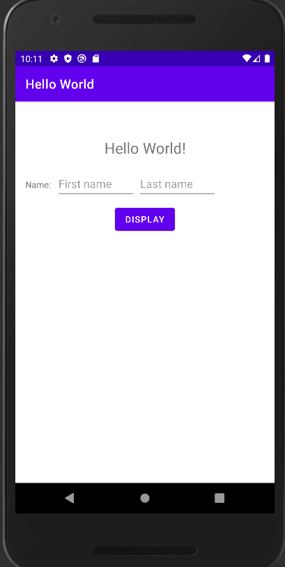
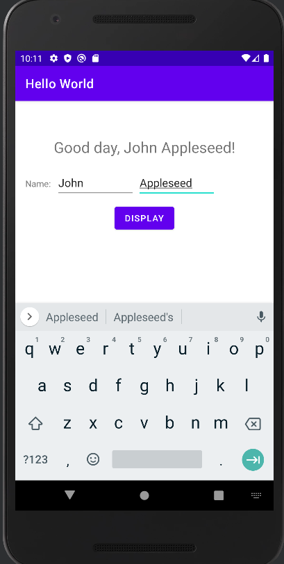

## Hello World App

A common Android mobile app for developers to practice.
This Android mobile app displays the text "Hello World!" to the user when first launched.
Users will have the option to enter in their name and the app will then greet them with their name.

### The UI

